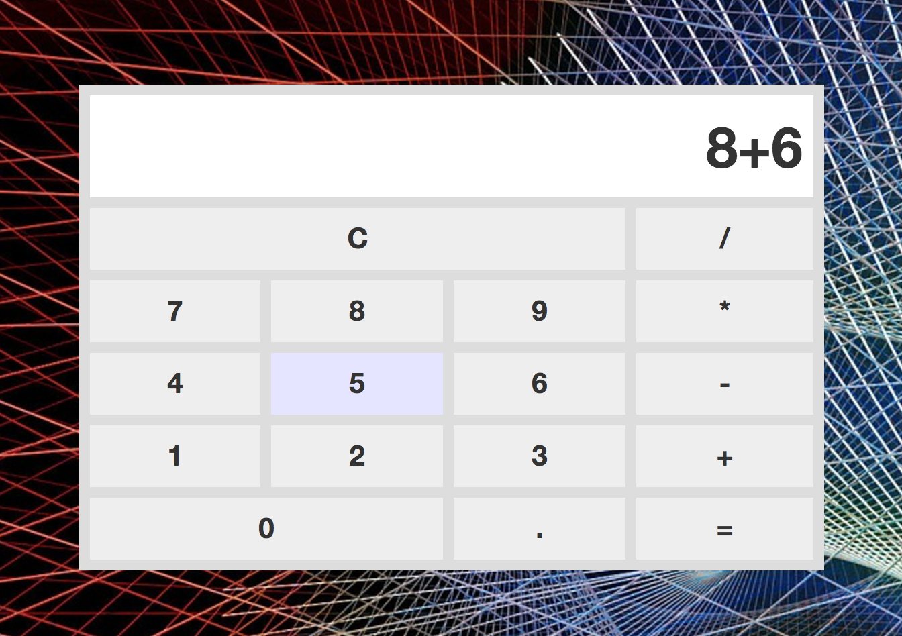

# Calculator

A JavaScript application to perform basic arithmetic operations.

## In This Document:
1. [Application URL](#application-url)
2. [How to Use the Application](#how-touse-the-application)
3. [Technologies Used](#technologies-used)
5. [Future Feature Sets](#future-feature-sets)
6. [Stumbling and Learning Points](#stumbling-and-learning-points)

## Application URL
Coming Soon!

## How to Use the Application
* User can click on buttons on the screen or press keyboard keys to enter numbers and operations
* User clicks on = or presses enter to see the result

## Technologies Used
  * HTML, CSS, JavaScript and jQuery

## Future Feature Sets:
  * Use the calculator for advanced scientific operations
  
## Stumbling and Learning Points:
  * None
  

[Up](README.md)
